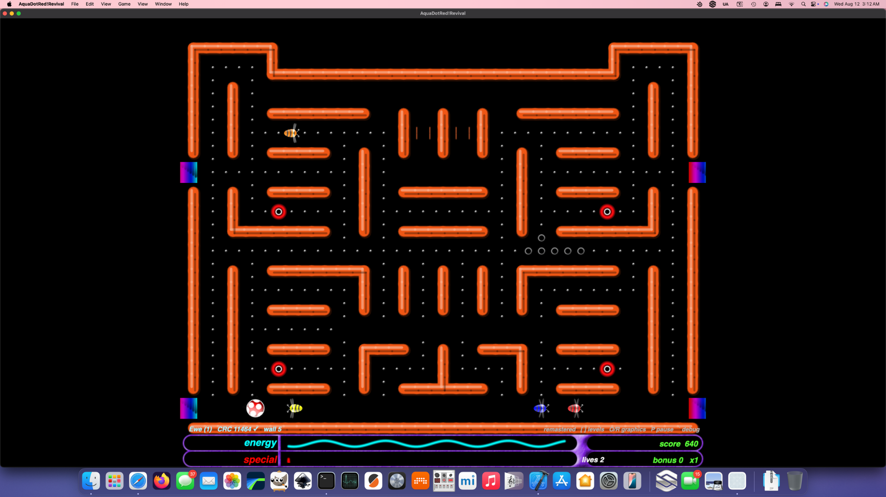
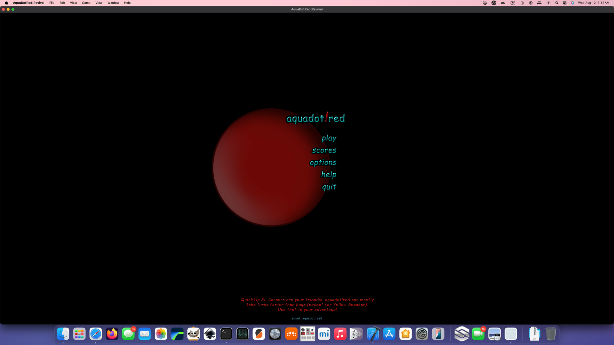
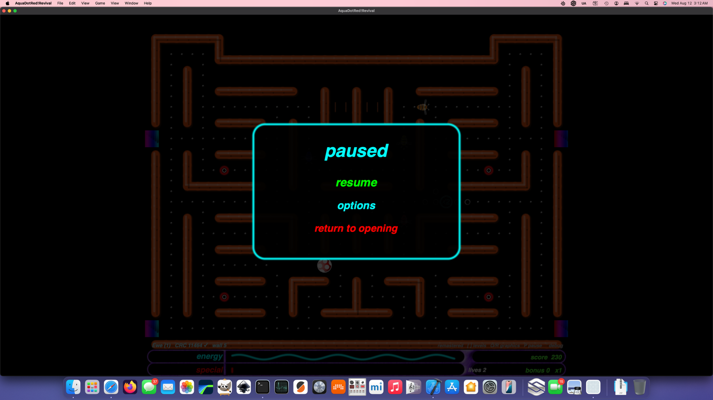

# AquaDotRedRevival

<p align="center">
  
</p>

<p align="center">
  <strong>A faithful native macOS + iPadOS revival/remaster of <em>aquadot!red</em>.</strong><br>
  Recovered original mazes. Recovered original art and audio. Reverse-engineered behavior. Modern Swift + SpriteKit runtime.
</p>

<p align="center">
  <strong>Current milestone:</strong> Phase 2.1.1 — playable remaster progression + collision fixes<br>
  <code>3d664d0</code>
</p>

---

## What is this?

So, this started as an attempt to get an old Mac game back on a modern machine and it has turned into something much more interesting: a preservation-driven reconstruction of **aquadot!red** using the surviving original game data as the source of truth.

This is **not** an AquaDot-inspired reinterpretation. The original maze files, artwork, audio, manuals, binary behavior, data formats, and recovered geometry define the target. The obsolete Carbon/SpriteWorld/OpenGL-era plumbing is being replaced with a native modern runtime around that design.

The goal here is simple:

> **What if the original developers had been able to ship a proper modern Retina remaster of aquadot!red?**

That means preserving how the game works first, then carefully remastering how it is presented without letting higher-resolution graphics change topology, collision, timing, or level design.

---

## Current screenshots

<table>
<tr>
<td width="50%" align="center">
<br>
<strong>Recovered opening / main menu</strong>
</td>
<td width="50%" align="center">
<br>
<strong>Native pause / options flow</strong>
</td>
</tr>
</table>

The screenshots above are from the current native **macOS** build. The runtime is shared with the iPadOS target; platform-specific input and presentation sit at the edges of the same simulation.

---

## Current state: this is actually a game now

Phase 1 gave the project an authentic-data runtime. Phase 2 reconstructed major gameplay systems and brought the recovered art/audio into the live game. Phase 2.1 stabilized the renderer/audio architecture and rebuilt the front end. Phase 2.1.1 fixed several issues found by actually playing through the remaster instead of staring at unit tests.

### Working now

- **205 recovered standard mazes** load from the original data corpus.
- Original maze CRC/checksum verification is implemented.
- Fixed-step movement, corridor topology, intersections and wrap connections are live.
- Normal dots and Munch dots are playable.
- Reconstructed Yummy/Yuk/Bonus/Multiplier systems are present.
- Four reconstructed bug personalities move through the real maze graph.
- Bug contact now actually drains AquaDot energy.
- The normal red AquaDot visibly spins while moving.
- Clearing the required dot field automatically advances to the next recovered level.
- Score, bonus, multiplier and lives survive normal level transitions.
- Original and Remastered visual modes share identical gameplay coordinates/state.
- Recovered AquaDot, bug, collectible, HUD, opening/menu and wall assets are integrated.
- The maze renderer distinguishes the original **large glossy `X` wall structures** from the recovered **thin numeric wall-frame system**.
- Opening screen, Play/Resume, Options, Help, About, Scores route, pause and return-to-opening flow work.
- Original audio is preserved; runtime playback uses a persistent pooled `AVAudioEngine` rather than constructing an `AVAudioPlayer` for every dot.
- Incremental collectible rendering and cached shortest-path tables dramatically reduce runtime churn.
- The debug overlay can report FPS, SpriteKit node count and pooled audio voices.

### Known rough edges

This is a serious playable milestone, not a finished release. The biggest known issue right now is a **wrap/teleport loop on the fourth orange-themed level**: certain wrap exits can re-trigger a paired wrap repeatedly. Pause and menu handling remain responsive, which points to a wrap state/exit-trigger problem rather than a global simulation lockup.

There are also still areas where the exact original behavior is only partially reconstructed: some speed/timing constants, full wall-piece selection details, final bug tuning, high-score persistence, complete help/scores behavior, some presentation polish, and broad iPad regression testing.

For the living list, see **[Known Issues](docs/KNOWN_ISSUES.md)**.

---

## Architecture

```text
Recovered original maze bytes
          │
          ▼
   AquaDotMazeParser  ───────── CRC verification
          │
          ▼
      AquaDotMaze              archival/file model
          │
          ▼
  AquaDotMazeTopology          graph + wraps + wall semantics
          │
          ▼
 AquaDotGameSimulation         platform-independent fixed-step rules
          │
          ▼
      MazeGameScene            SpriteKit presentation
          │
    ┌─────┴─────┐
    ▼           ▼
 native Mac    iPadOS
```

The important boundary is:

> **file format != simulation != renderer**

A Retina wall, a recovered original wall sprite, and a debug line can all represent the same logical maze edge. None of them are allowed to redefine the maze.

For the engineering detail, start with:

- [Phase 1 Architecture](docs/PHASE1_ARCHITECTURE.md)
- [Phase 2 Architecture](docs/PHASE2_ARCHITECTURE.md)
- [Phase 2.1 Architecture](docs/PHASE2_1_ARCHITECTURE.md)
- [Phase 2.1.1 Patch Notes](docs/PHASE2_1_1_PATCH_NOTES.md)
- [Platform Architecture](docs/PLATFORM_ARCHITECTURE.md)

---

## Original vs Remastered

The project deliberately keeps two presentation goals alive at once.

### Original mode

- recovered original pixels/assets wherever practical;
- original proportions, placement and animation registration;
- preservation-oriented presentation;
- useful as a visual truth/reference while reverse engineering.

### Remastered mode

- same maze topology and game state;
- high-resolution derivatives or scalable recreations based on recovered originals;
- cleaner Retina edges, bevels and alpha;
- no arbitrary redesign of silhouettes or maze geometry.

The remaster should feel like the **same game rendered better**, not another game borrowing AquaDot's name.

---

## Maze reconstruction

The maze is the dominant visual object on screen, so it matters more than almost anything else to authenticity.

The current renderer now respects the original hierarchy recovered from the assets and binary evidence:

```text
X fields
  └─> large glossy / solid maze structures

numeric wall codes 1...14
  └─> recovered thin-line wall frame system
```

That corrected a major visual problem in the first remaster pass, where too much of the maze was being rendered as one generalized modern wall style.

What is **not** fully solved yet is the complete historical `9w/10w` solid-wall sub-piece selection behavior from the original `_drawMazePiece` path. The current scalable solid-wall reconstruction is much closer to the original presentation, but that remaining mapping is still an explicit reverse-engineering target rather than something we pretend is already exact.

---

## Controls — macOS development build

| Control | Action |
|---|---|
| Arrow keys / WASD | Move AquaDot |
| Space | Activate an available Yummy power |
| P / Escape | Pause / resume |
| O | Original graphics |
| R | Remastered graphics |
| `[` / `]` | Previous / next recovered maze (development) |
| Backtick | Reconstruction/performance overlay |

The menu/options layer is replacing development-only shortcuts as the project matures.

---

## Build

### macOS

Open the native Xcode project:

```bash
open 'AquaDotRed!Revival/AquaDotRed!Revival.xcodeproj'
```

For cleaner compiler diagnostics, the command-line build is usually better:

```bash
rm -rf /tmp/AquaDotDerivedData && \
set -o pipefail && \
xcodebuild \
  -project 'AquaDotRed!Revival/AquaDotRed!Revival.xcodeproj' \
  -scheme 'AquaDotRed!Revival' \
  -configuration Debug \
  -destination 'platform=macOS,arch=arm64' \
  -derivedDataPath /tmp/AquaDotDerivedData \
  clean build 2>&1 | tee ~/Desktop/AquaDot-build.log
```

### Linux

The Apple app itself requires Xcode/macOS to build, but a large amount of this project remains intentionally friendly to Linux-hosted preservation and engineering work: archive analysis, asset processing, maze validation, documentation, patch tooling and platform-independent simulation work.

Patch/install scripts in this project should remain usable from standard **Bash on both macOS and Linux** unless a task is inherently Apple-specific.

---

## Roadmap

The detailed roadmap lives in **[docs/ROADMAP.md](docs/ROADMAP.md)**. The short version:

| Stage | State | Goal |
|---|---|---|
| Phase 1 | ✅ Milestone | Authentic original-data runtime |
| Phase 2 | ✅ Milestone | Behavioral + first OG/remaster gameplay reconstruction |
| Phase 2.1 | ✅ Milestone | Performance stabilization + original opening/menu + corrected maze hierarchy |
| Phase 2.1.1 | ✅ Current milestone | Collision, movement animation and automatic campaign progression fixes |
| Stabilization follow-up | 🔧 Next | Fix orange-level wrap loop and regression-test wrap pairs |
| Phase 3 | 🧭 Planned | Complete content/presentation/remaster pass |
| Phase 4 | 🧭 Planned | Editor revival + release/platform polish |

The next move is deliberately boring in the best possible way: **fix observed bugs before stacking another giant feature phase on top of them.**

---

## Documentation map

- **[STATUS.md](docs/STATUS.md)** — exactly what works today.
- **[KNOWN_ISSUES.md](docs/KNOWN_ISSUES.md)** — observed failures and unresolved RE targets.
- **[ROADMAP.md](docs/ROADMAP.md)** — project phases and next work.
- `docs/PHASE*_ARCHITECTURE.md` — implementation/reverse-engineering architecture.
- `docs/PHASE*_PATCH_NOTES.md` — milestone-specific changes.
- `preservation/` — recovered original material kept distinct from new runtime code.

---

## Preservation and provenance

The original proprietary first-party C/C++ source text was **not** recovered verbatim.

The new runtime code in this repository is reconstruction work derived from surviving shipped material including:

- original maze files and checksums;
- original graphics and resource-fork material;
- original Ogg/Vorbis audio resources;
- manuals and strategy documentation;
- executable/disassembly evidence;
- recovered source-unit names, function metadata, strings and constants.

That distinction matters. Historical binary evidence is evidence; reconstructed Swift is reconstructed Swift. The project should remain explicit about which is which.

---

## Why bother?

Because software preservation gets much more interesting when it goes beyond screenshots and executable archaeology.

AquaDot!red had real level design, a distinctive visual language, its own weird little mechanics, and a surprising amount of authored content. Modern macOS cannot simply run the old 32-bit Carbon-era executable, so preserving the experience means understanding enough of the original system to rebuild it properly.

As of right now, that rebuilt system is playable, visibly recognizable, progressing through the original maze corpus, and getting closer to the real thing with every pass.

That's the point.
