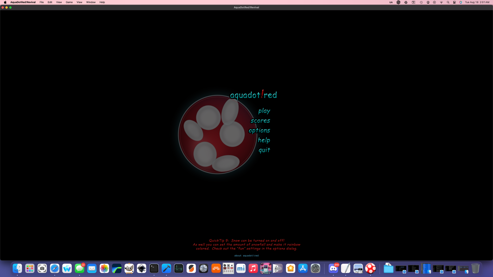

# AquaDotRedRevival

<p align="center">
  
</p>

<p align="center">
  <strong>A faithful native macOS + iPadOS revival/remaster of <em>aquadot!red</em>.</strong><br>
  Recovered original mazes. Recovered original art and audio. Reverse-engineered behavior. Modern Swift + SpriteKit runtime.
</p>

<p align="center">
  <strong>Current milestone:</strong> Phase 4H — main-menu AquaDot remaster<br>
  Preservation-first reconstruction with an optional high-resolution Remastered presentation.
</p>

---

## What is this?

AquaDotRedRevival began as an attempt to make an old Mac game run again and has become a preservation-driven reconstruction of **aquadot!red** using the surviving shipped game data as the source of truth.

This is **not** an AquaDot-inspired reinterpretation. The recovered maze files, artwork, audio, manuals, executable behavior, data formats, geometry and other surviving material define the target. The obsolete Carbon/SpriteWorld/OpenGL-era plumbing is being replaced with a native modern runtime around that design.

The goal is:

> **What if the original developers had been able to ship a proper modern Retina remaster of aquadot!red?**

That means restoring how the game works first, then improving presentation without allowing higher-resolution graphics to redefine topology, collision, timing or level design.

---

## Current screenshots

<table>
<tr>
<td width="50%" align="center">
<br>
<strong>Phase 4H remastered opening / main menu</strong>
</td>
<td width="50%" align="center">
<br>
<strong>Remastered gameplay using recovered maze data</strong>
</td>
</tr>
</table>

The title-screen capture above is from the native **macOS** build after the Phase 4H menu-AquaDot remaster. The runtime is shared with the iPadOS target; platform-specific input and presentation sit at the edges of the same simulation.

---

## Current state: a playable restoration with an authenticity pass in progress

Phase 1 established the recovered-data runtime. Phase 2 reconstructed the major gameplay systems and integrated surviving art/audio. The Phase 2.1 line stabilized rendering, collision, progression, wrap behavior and the recovered front end. Phase 3 rebuilt the campaign lifecycle. **Phase 4 is now concentrating on binary-backed gameplay authenticity and high-resolution remastering while keeping Original mode intact as the preservation reference.**

### Working now

- **205 recovered standard mazes** load from the original data corpus.
- Original maze CRC/checksum verification is implemented.
- Fixed-step movement, corridor topology, intersections and wrap connections are live.
- Normal dots, Munch dots, Yummy/Yuk/Bonus/Multiplier systems and sprout behavior are integrated.
- Dot collection advances through the recovered campaign and feeds the reconstructed/recovered scoring systems.
- The original **Skill** scoring formulas and thresholds recovered from the executable are implemented.
- Level completion uses the documented **(Bonus + Skill) × Multiplier** structure and a recovered-art tween-level summary.
- Game Over, auto-save/resume, persistent high scores and campaign progression are live.
- The recovered eight-strategy ordinary bug roster is represented: Hunter, Blocker, Sneaker, Hound Dog, Lone Wolf, Hermit, Protector and Mantis.
- Advanced Protector, Mantis and Hermit behavior now uses binary-recovered state/timing logic where the evidence is strong enough.
- **Neon is modeled as an appearance/disguise applied over a real underlying strategy**, matching the recovered executable architecture rather than acting as a ninth personality.
- Original and Remastered visual modes share identical gameplay coordinates/state.
- Original mode preserves/reconstructs the historical presentation path; Remastered mode now includes high-resolution AquaDot, bug, collectible, sprout and menu-hero art.
- The Phase 4H opening-screen AquaDot uses the recovered large spot/pad visual language while retaining the existing menu layout, opacity and slow rotation.
- The original solid-wall renderer, recovered thin wall-frame system and large glossy `X` structures are represented separately instead of being flattened into one generic wall style.
- Original audio is preserved; runtime playback uses a persistent pooled `AVAudioEngine`.
- Incremental collectible rendering and cached shortest-path tables reduce runtime churn.
- The debug overlay can report FPS, SpriteKit node count and pooled audio voices.

### Known reconstruction boundaries

The project intentionally keeps uncertainty visible instead of silently turning guesses into "original" behavior. Remaining targets include the Reaper's special gameplay semantics, some shared/base bug-locomotion and strategy-dispatch details, a few unresolved timing/randomness constants, exact equivalence for every historical presentation edge case, and broader iPadOS regression testing.

Reconstructed or newly remastered assets are documented as such. A high-resolution recreation based on recovered component artwork is **not** labeled as a recovered historical master.

For the living list, see **[Known Issues](docs/KNOWN_ISSUES.md)**.

---

## Architecture

```text
Recovered original maze bytes
          │
          ▼
   AquaDotMazeParser  ───────── CRC verification
          │
          ▼
      AquaDotMaze              archival/file model
          │
          ▼
  AquaDotMazeTopology          graph + wraps + wall semantics
          │
          ▼
 AquaDotGameSimulation         platform-independent fixed-step rules
          │
          ▼
      MazeGameScene            SpriteKit presentation
          │
    ┌─────┴─────┐
    ▼           ▼
 native Mac    iPadOS
```

The important boundary is:

> **file format != simulation != renderer**

A Retina wall, a recovered original wall sprite and a debug line can all represent the same logical maze edge. None of them are allowed to redefine the maze.

For engineering and reverse-engineering detail, start with:

- [Phase 1 Architecture](docs/PHASE1_ARCHITECTURE.md)
- [Phase 2 Architecture](docs/PHASE2_ARCHITECTURE.md)
- [Phase 2.1 Architecture](docs/PHASE2_1_ARCHITECTURE.md)
- [Phase 3 Campaign Architecture](docs/PHASE3_ARCHITECTURE.md)
- `docs/reverse-engineering/` — later binary-recovery evidence and Phase 4 authenticity notes
- [Platform Architecture](docs/PLATFORM_ARCHITECTURE.md)

---

## Original vs Remastered

The project deliberately keeps two presentation goals alive at once.

### Original mode

- recovered original pixels/assets wherever practical;
- reconstructed historical composites only when flattened originals did not survive;
- original proportions, placement and animation registration;
- preservation-oriented presentation and a visual truth/reference while reverse engineering.

### Remastered mode

- exactly the same maze topology and game state;
- high-resolution derivatives or scalable recreations based on recovered originals;
- cleaner Retina edges, bevels, alpha and readable high-resolution detail;
- no arbitrary redesign of gameplay silhouettes or maze geometry.

The remaster should feel like the **same game rendered better**, not another game borrowing AquaDot's name.

---

## Maze reconstruction

The maze is the dominant gameplay object on screen, so renderer authenticity matters enormously.

The current renderer respects the recovered hierarchy between large solid/glossy structures and the numeric thin-wall-frame system rather than rendering the entire maze through one generalized modern style.

```text
X fields
  └─> large glossy / solid maze structures

numeric wall codes
  └─> recovered thin-line wall frame system
```

Where exact historical sub-piece or rendering behavior remains uncertain, the reconstruction notes keep that boundary explicit.

---

## Controls — macOS development build

| Control | Action |
|---|---|
| Arrow keys / WASD | Move AquaDot |
| Space | Activate an available Yummy power |
| P / Escape | Pause / resume |
| O | Original graphics |
| R | Remastered graphics |
| `[` / `]` | Previous / next recovered maze (development) |
| Backtick | Reconstruction/performance overlay |

---

## Build

### macOS

Open the native Xcode project:

```bash
open 'AquaDotRed!Revival/AquaDotRed!Revival.xcodeproj'
```

For compiler diagnostics, the command-line build is usually cleaner:

```bash
rm -rf /tmp/AquaDotDerivedData && \
set -o pipefail && \
xcodebuild \
  -project 'AquaDotRed!Revival/AquaDotRed!Revival.xcodeproj' \
  -scheme 'AquaDotRed!Revival' \
  -configuration Debug \
  -destination 'platform=macOS,arch=arm64' \
  -derivedDataPath /tmp/AquaDotDerivedData \
  clean build 2>&1 | tee ~/Desktop/AquaDot-build.log
```

### Linux

The Apple app itself requires Xcode/macOS to build, but much of the preservation and engineering workflow remains intentionally Linux-friendly: archive analysis, asset processing, maze validation, documentation, patch tooling and platform-independent simulation work.

Patch/install scripts should remain usable from standard **Bash on macOS and Linux** unless a task is inherently Apple-specific.

---

## Restoration milestones

| Stage | State | Goal |
|---|---|---|
| Phase 1 | ✅ | Authentic original-data runtime |
| Phase 2 / 2.1 | ✅ | Gameplay reconstruction, recovered presentation and stabilization |
| Phase 3 / 3B–3D | ✅ | Campaign lifecycle, authenticity passes and runtime closure |
| Phase 4A | ✅ | Original solid-wall renderer restoration |
| Phase 4B | ✅ | Original Skill scoring recovery |
| Phase 4C | ✅ | High-resolution AquaDot player remaster |
| Phase 4D | ✅ | High-resolution bug remaster |
| Phase 4E | ✅ | High-resolution collectibles/playfield remaster |
| Phase 4F | ✅ | Advanced bug-AI recovery |
| Phase 4G | ✅ | Original bug roster + Neon architecture recovery |
| **Phase 4H** | **🔥 Current** | **Spotted high-resolution main-menu AquaDot remaster** |
| Next | 🔧 | Continue unresolved binary-backed gameplay authenticity before release polish |

---

## Documentation map

- **[STATUS.md](docs/STATUS.md)** — project status tracking.
- **[KNOWN_ISSUES.md](docs/KNOWN_ISSUES.md)** — observed failures and unresolved RE targets.
- **[ROADMAP.md](docs/ROADMAP.md)** — project roadmap.
- `docs/PHASE*_ARCHITECTURE.md` — implementation/reverse-engineering architecture from the early phases.
- `docs/PHASE*_PATCH_NOTES.md` — milestone-specific early-phase changes.
- `docs/reverse-engineering/` — preserved disassembly evidence, recovered constants and later authenticity work.
- `preservation/` — recovered original material kept distinct from new runtime code.
- `tools/` — cross-platform audits, asset reconstruction tools and regression helpers.

---

## Preservation and provenance

The original proprietary first-party C/C++ source text was **not** recovered verbatim.

The new runtime code is reconstruction work derived from surviving shipped material including:

- original maze files and checksums;
- original graphics and resource-fork material;
- original Ogg/Vorbis audio resources;
- manuals and strategy documentation;
- executable/disassembly evidence;
- recovered source-unit names, function metadata, strings and constants.

That distinction matters. Historical binary evidence is evidence; reconstructed Swift is reconstructed Swift; newly remastered artwork is newly remastered artwork. The repository keeps those categories explicit.

---

## Why bother?

Because software preservation gets much more interesting when it goes beyond screenshots and executable archaeology.

AquaDot!red had real level design, a distinctive visual language, unusual mechanics and a surprising amount of authored content. Modern macOS cannot simply run the old 32-bit Carbon-era executable, so preserving the experience means understanding enough of the original system to rebuild it properly.

The result is now a native playable reconstruction running through recovered content while increasingly matching the original executable's behavior — with a separate Remastered presentation that asks what the same game could have looked like with modern display resolution.

That's the point.
